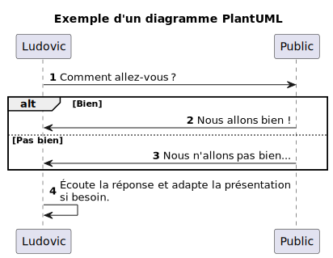

# Exemple d'utilisation de Marp

<!--
_class: lead
_paginate: false
-->

<https://github.com/ludelafo/teaching-tools-demonstration>

<small>L. Delafontaine, avec l'aide de GitHub Copilot.</small>

<small>Ce travail est sous licence [CC BY-SA 4.0][license].</small>

![bg opacity:0.1][illustration-principale]

## Fonctionnement de Marp

- Marp est un outil open source qui permet de créer des présentations à partir
  de fichiers Markdown.
- La configuration se trouve dans un en-tête YAML au début du fichier.
- Il est possible d'utiliser des thèmes déjà disponibles ou d'en réaliseren CSS.
- Le rendu peut être effectué en ligne de commande ou via des extensions pour
  différents éditeurs de texte (Visual Studio Code, etc.).

## Rédaction en Markdown

- Le contenu des diapositives est rédigé en Markdown, un langage de balisage
  léger.
- Chaque diapositive est séparée automatiquement par le titre (`#`) ou par une
  ligne contenant trois tirets (`---`).
- Il est possible d'ajouter des classes CSS personnalisées aux diapositives pour
  modifier leur apparence ou leur comportement.
- Voici quelques fonctionnalités de Marp dans les diapositives qui suivent.

## Démonstration

<!-- _class: lead -->

Cette diapositive est centrée grâce à l'annotation `<!-- _class: lead -->`.

## Images (1)

- Il est possible d'insérer des images avec Marp.
- Quelques options permettent de modifier leur affichage (taille, alignement,
  etc.) à l'aides des mots clés `bg`, `fit`, `left`, `right`, `center`, etc.

![bg right][illustration-principale]

## Images (2)

![bg left opacity:0.5][illustration-principale]

## Images (3)

![bg right:40%][illustration-principale]

## Images (4)



---

<!-- _header: "" -->
<!-- _footer: "" -->
<!-- _paginate: false -->

![bg][illustration-principale] ![bg][illustration-principale]
![bg][illustration-principale]

## Images (6)

![bg right][illustration-principale] ![bg right][illustration-principale]
![bg right vertical][illustration-principale]

## Tableaux

| Colonne 1 | Colonne 2 | Colonne 3 |
| :-------- | :-------: | --------: |
| Valeur 1  | Valeur 2  |  Valeur 3 |
| Valeur 4  | Valeur 5  |  Valeur 6 |

## Blocs de code

```java
public class HelloWorld {
    public static void main(String[] args) {
        System.out.println("Hello, World!");
    }
}
```

## Listes

- Premier élément
- Deuxième élément
- Troisième élément

1. Premier élément
2. Deuxième élément
3. Troisième élément

## Citations

> Ceci est un bloc de citation.
>
> Il peut contenir plusieurs lignes.
>
> Il est souvent utilisé pour mettre en avant des citations ou des notes
> importantes.

## Liens

Je peux insérer des liens, comme ce lien vers [GitHub](https://github.com).

Ou encore des liens complets : <https://github.com>.

## Sources

- [Illustration principale][illustration-principale] par
  [Alexander Grey](https://unsplash.com/@sharonmccutcheon) sur
  [Unsplash](https://unsplash.com/photos/assorted-books-on-wooden-table-eMP4sYPJ9x0)

<!-- URLs -->

[license]:
	https://github.com/ludelafo/teaching-tools-demonstration/blob/main/LICENSE.md

<!-- Illustrations -->

[illustration-principale]:
	https://images.unsplash.com/photo-1516979187457-637abb4f9353?fit=crop&h=720
